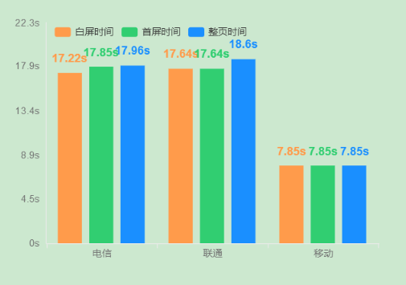
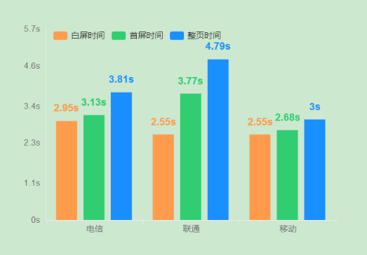

### 前言

众所周知，使用国内的服务器建站必须要备案，而备案是一个比较繁琐的步骤，不同省份要求不一样，有些站长可能无法通过备案。基于这个原因很多人就选择了`Linode`、`DigitalOcean`、`Vultr`这类的海外服务器，但是访问速度也随之下降了。

对于那些静态页面的博客或者是普通门户网站来说，这种速度下降尚可接受，但是对于使用了`WebSocket`技术的`NodeBB`来说，经常会出现页面加载不出来的情况，要刷新页面才行，因为`WebSocket`需要保持长连接，本来海外`VPS`就慢，还要保持长连接，这只会让速度更慢。所以我们需要关掉`WebSocket`改用`Polling`，也就是轮询。虽然那这会导致`NodeBB`的聊天功能不及时响应消息，但是对于速度来说确实会得到巨大提升。

`NodeBB`使用了`Socket.io`，其内部封装了`WebSocket`和`Polling`两种技术，所以这种切换是很容易实现的。


### 修改方法：

打开`NodeBB`的配置文件`config.json`，加入三行，看起来效果如下：

```json
{
...
  "socket.io": {
    "transports": ["polling"]
  },
...
}
```

### 性能测试

根据性能魔方的测试，修改为`Polling`之后论坛的访问速度提升很大，`白屏时间+首屏时间+整页时间`的变化如下图所示：

#### 使用`WebSocket`



#### 使用`Polling`

